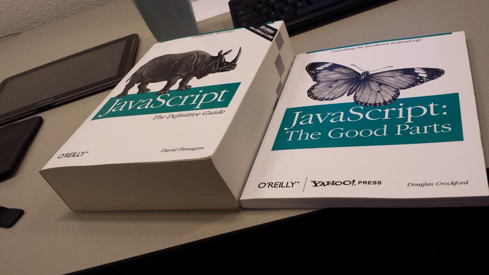

# Apresentação

## Quem sou

- Desenvolvedor de software desde 2008
- Recife/Pernambuco
- 2008~15 Instituto Nokia de Tecnologia
- 2015~ Expertise Solutions
- Projetos:
    - PySide
    - Webkit
    - EFL (JS, C#)

# No começo, era o Javascript

## Javascript

- [Hack de 10 dias em 1995](http://speakingjs.com/es5/ch04.html)
- Que virou um dos pilares da web
\note{Junto com HTML e CSS}
- Alto nível, prototypes, sintaxe que lembra Java
- Principais implementações
    - V8 - Blink (Chrome) e Node
    - JavascriptCore - Webkit (Safari)
    - Spidermonkey - Gecko (Firefox)
    - Chakra - Edge

## Problemas

{ width=100% }


## Problemas

- Array(16).join("LoL" - 2) + " Batman!"
- Ficar preso a uma única linguagem
    - [Transpilers e afins](https://github.com/jashkenas/coffeescript/wiki/list-of-languages-that-compile-to-js)
    - Ainda assim, é Javascript
- [TOO MUCH JS](https://medium.com/@addyosmani/the-cost-of-javascript-in-2018-7d8950fbb5d4)
- Alto nível demais
    - Problema ao usar JS normal como "assembly"

## Problemas

```js
!function(e,t){"use strict";"object"==typeof
module&&"object"==typeofmodule.exports?
module.exports=e.document?t(e,!0):function(e){
if(!e.document)throw new Error("jQuery
requires a window with a document");
return t(e)}:t(e)}("undefined"!=typeof
window?window:this,function(e,t){"use strict";
var n=[],r=e.document,i=Object.getPrototypeOf,
o=n.slice,a=n.concat,s=n.push,u=n.indexOf,l={},
...
```

## Porque é tão pesado?

- [Javascript](https://blog.sessionstack.com/how-javascript-works-a-comparison-with-webassembly-why-in-certain-cases-its-better-to-use-it-d80945172d79)
    - [Parsear](http://www.mattzeunert.com/2017/01/30/lazy-javascript-parsing-in-v8.html)
    - Gerar bytecode
    - Otimizar (JIT e afins)
    - Re-Otimizar
    - Rodar

# "Assembly" da Web

## asm.js

- [Subset de Javascript](http://asmjs.org/faq.html)
- Dicas para o interpretador do código que vai ser executado
- Permite otimizações mais certeiras e eficientes

## asm.js - C

```c
size_t strlen(char *ptr) {
  char *curr = ptr;
  while (*curr != 0) {
    curr++;
  }
  return (curr - ptr);
}
```

## asm.js - js


```javascript
function strlen(ptr) {
  ptr = ptr|0;
  var curr = 0;
  curr = ptr;
  while (MEM8[curr]|0 != 0) {
    curr = (curr + 1)|0;
  }
  return (curr - ptr)|0;
}
```

## asm.js

- Ainda é javascript
- Ainda precisa ser parseado
- Pode ser melhorado

# WebAssembly

## WebAssembly

- Formato binário
    - Não precisa ser parseado, apenas decodado
- Tipos já determinados
- VM em pilha
- Suporte a uma versão MVP nos 4 principais navegadores
- Gerenciamento manual de memória

## WebAssembly Text Format

```wast
(module
        (func $addTwo (param $lhs i32)
                      (param $rhs i32)
                      (result i32)
                get_local $lhs
                get_local $rhs
                i32.add)
        (export "addTwo" (func $addTwo))
)
```

## Processador hipotético

- 8-bit bytes
- Memória byte a byte
    - [Linear](https://webassembly.github.io/spec/core/syntax/modules.html#syntax-mem)
- Suporte a acessos não-alinhados
- Inteiros de 32bits e opcionalmente 64bits
- IEEE 754-2008 para floats de 32 e 64bits
    - Mas sem exceções p/ NaN por enquanto
- Little endian
- Ponteiros de 32bits
    - wasm64 suporta ponteiros de 64bits

## Syscalls e afins

- Não existem
    - [ABI em discussão](https://github.com/WebAssembly/tool-conventions/issues/27)
- Host expõe uma API

# emscripten

## emscripten

- Backend LLVM
- clang como frontend
- Gera código asm.js ou WebAssembly
- Usos
    - Unity
    - Qt
    - DOSBox

## emscripten

{ width=100% }

## emscripten runtime environment

- [Ports](https://github.com/emscripten-ports)
    - [SDL 2.0](https://github.com/emscripten-ports/SDL2)
    - ...
- [OpenGL ES 2.0](https://kripken.github.io/emscripten-site/docs/porting/multimedia_and_graphics/OpenGL-support.html)
- [Sistema de arquivos virtual](https://kripken.github.io/emscripten-site/docs/porting/files/file_systems_overview.html#file-system-overview)
    - MEMFS
    - IDBFS
    - NODEFS (node.js)
- [Memória](https://kripken.github.io/emscripten-site/docs/porting/emscripten-runtime-environment.html#emscripten-memory-representation)
    - Typed Array único
    - Várias views (int, float, etc)
- [pthreads](https://kripken.github.io/emscripten-site/docs/porting/pthreads.html)
    - asm.js
    - Experimental em WebAssembly

## emscripten - main loop

- Não pode bloquear
- Função de iteração
- [emscripten_set_main_loop](https://kripken.github.io/emscripten-site/docs/api_reference/emscripten.h.html#c.emscripten_set_main_loop_arg)
- [emscripten_cancel_main_loop](https://kripken.github.io/emscripten-site/docs/api_reference/emscripten.h.html#c.emscripten_cancel_main_loop)

## emscripten - linkagem e memória

- [Linkagem estática](https://github.com/kripken/emscripten/wiki/Linking)
    - Como garantir de onde as libs vem?
    - Módulos JS dinamicamente
- [Problemas com acessos desalinhados](https://kripken.github.io/emscripten-site/docs/porting/Debugging.html#memory-alignment-issues)
    - SAFE_HEAP para diagnóstico

# Demos

# Hoje e Amanhã

## Hoje

- C/C++
- [Rust](https://rustwasm.github.io/book/)
- [MVP nos principais navegadores.](https://webassembly.org/docs/mvp/)
    - Módulo exportado
    - Instruções
    - Formato binário
    - Formato textual
    - Implementações nos browsers e outros ambientes

## Amanhã (e depois de amanhã)

- [Roadmap](https://webassembly.org/roadmap/)
    - Especificação
    - Threads
    - GC
    - Exceções
    - Host bindings (DOM/JS)
    - Ferramentas
    - Multi processos (fork & cia)
    - Mais controle de memória
    - ABI
    - [Segurança](https://www.fastly.com/blog/hijacking-control-flow-webassembly)

# Referências

## Links úteis

- Projeto
    - https://webassembly.org
- MUITOS links de projetos, ferramentas, etc
    - https://github.com/mbasso/awesome-wasm
- WebAssembly and the Death of Javascript
    - https://www.youtube.com/watch?v=pBYqen3B2gc 
- Emscripten
    - https://kripken.github.io/emscripten-site/index.html
- Blog da Mozilla
    - https://hacks.mozilla.org/category/webassembly/

# Perguntas
